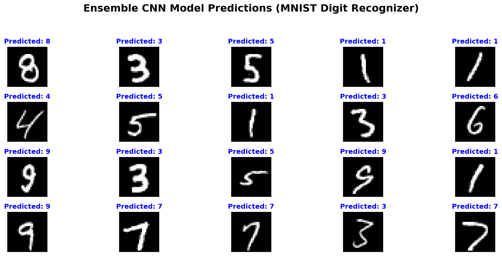

# 🏆 Kaggle Digit Recognizer (MNIST) — Top 6% Solution

**Final Score:** 0.99628 Accuracy  
**Rank:** 72 / 1181 (Top 6%)  
**Tech Stack:** Python, TensorFlow/Keras, Pandas, NumPy, Scikit-Learn

## 📋 Methodology Overview
This solution uses an **Ensemble of Deep Convolutional Neural Networks (CNNs)** combined with **Data Augmentation** and **Test Time Augmentation (TTA)** to achieve high-precision handwritten digit classification.

### 1. Data Preprocessing
- **Normalization:** Scaled pixel values from `[0, 255]` to `[0.0, 1.0]`.
- **Reshaping:** Transformed 1D pixel arrays (784) into 3D image tensors `(28, 28, 1)`.
- **Label Encoding:** Applied One-Hot Encoding for 10-class classification.

### 2. Model Architectures (Ensemble)
We utilized an ensemble of **5 diverse CNN models** to minimize variance and boost generalization:
- **CNN-A & C (2-Block):** 2x Conv2D(32) → 2x Conv2D(64) → Dense(256).
- **CNN-B & E (3-Block):** 2x Conv2D(32) → 2x Conv2D(64) → 2x Conv2D(128) → Dense(512).
- **CNN-D (Wider):** 2x Conv2D(64) → 2x Conv2D(128) → Dense(512).
- **Regularization:** Used `BatchNormalization`, `Dropout` (0.25 - 0.5), and `Maxpooling2D` in every block.

### 3. Training Strategy
- **Optimizer:** `Adam` with adaptive learning.
- **Data Augmentation:** Real-time generation with rotation (15°), zoom (15%), width/height shifts (15%), and shear (0.1).
- **Callbacks:** 
  - `ReduceLROnPlateau`: Halves learning rate when validation accuracy plateaus.
  - `EarlyStopping`: Restores best weights for each model from the optimal epoch.
- **Epochs:** Up to 50 epochs per model.

### 4. Inference & TTA
- **Test Time Augmentation (TTA):** For each test image, we generated **15 augmented versions** per model.
- **Averaging:** Aggregated the softmax probability outputs from all **80 forward passes** (5 models × 16 passes) per image.
- **Final Prediction:** Selected the class with the highest average probability.

## 📈 Quantified Results
| Model Component | Validation Accuracy | Leadboard (LB) Impact |
| --- | --- | --- |
| Single CNN (Initial) | ~99.54% | 0.99503 |
| **5-Model Ensemble + TTA** | **~99.57% (Avg)** | **0.99628** |

## 🚀 How to Run
1. **Download Data:** `kaggle competitions download -c digit-recognizer`
2. **Train Models:** `python train_ensemble.py`
3. **Generate Submission:** `python predict_ensemble.py`
